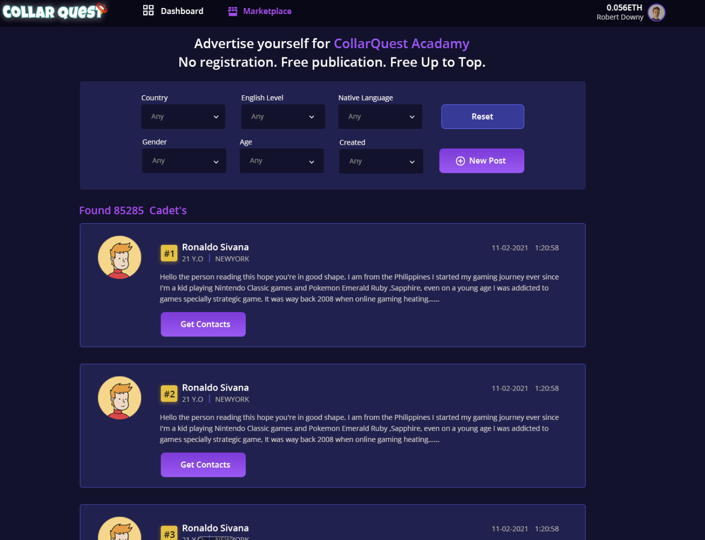
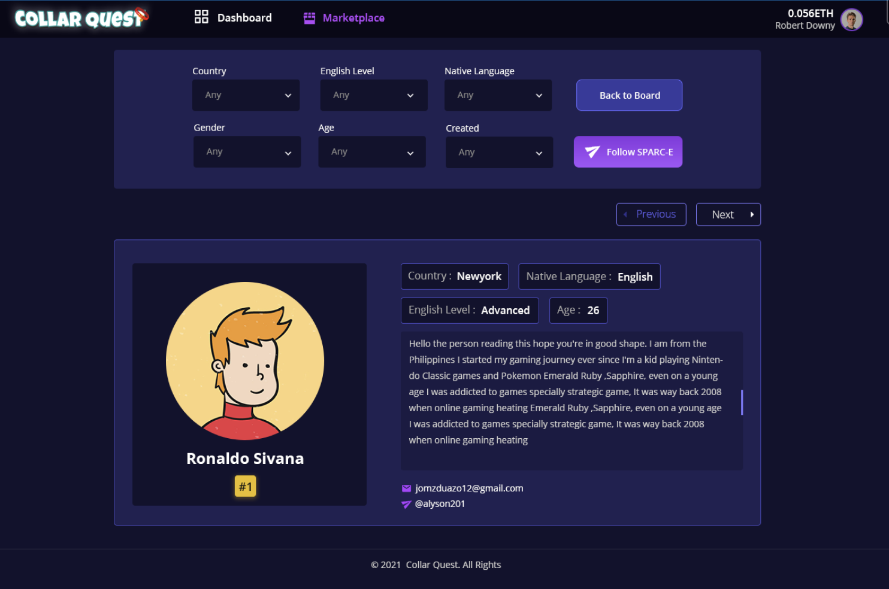

# CollarQuest Academy

### What is CollarQuest Academy?

A CollarQuest Academy manager is when (a player who has more than enough SPARC-E) gets a cadet (a player who can’t afford their own SPARC-E team) to play the game for them using their SPARC-E. The Genesis Mechanism (GeM) earned by the cadet will then be split between the manager and the cadet depending on their agreement. It can be 50-50, 60-40, or however their conversation will go.

Cadets do not have access to the GeM token that they earned in-game. It will be the manager that will process the withdrawal of the GeM token. The cadet can opt to receive either hard cash of their chosen currency (USD, GeM token, etc.) or cryptocurrency (TAG, ETH, etc.). Payment schemes should be discussed beforehand given that withdrawals can only be done once every 2 weeks. Both cadet and manager should also consider the timing of withdrawals because of the fluctuating nature of GeM token and crypto in general, what is $100 in GeM token today, may be worth $150 tomorrow or less, etc.

Cadets can signup to be considered by a manager at: [https://collarquest.com/scholarship](https://collarquest.com/scholarship)

<figure><figcaption>
CollarQuest Cadet Search/Sort
</figcaption></figure>

### **How do I become a** CollarQuest Academy **Cadet?**

Becoming a CollarQuest Academy Cadet involves a lot of trust because all of the risks involved (such as getting the account banned) in a CollarQuest Academy lies mostly on the manager. It is the manager’s SPARC-Es after all. There is almost no risk in being a cadet. There are no laws protecting the manager’s assets, and most cadet-manager relationships are remote. If you are a cadet, please, do take care of your manager’s SPARC-Es.

There are several ways to get a SPARC-Es via the CollarQuest Academy but the most effective way is still personally knowing a SPARC-Es manager and asking to be their cadet. Because of the saturation of players wanting to play without being able to afford their own teams, there is an unlimited supply of potential cadets. Most of which come from 3rd world countries.

In fact, there is so much demand for a SPARC-Es CollarQuest Academy that people who want one will be willing to write resumes and are constantly posting in SPARC-Es Manager groups with why they should be chosen. If you are looking for a SPARC-Es CollarQuest Academy, I suggest that you start in the COLLAR discord server

<figure><figcaption>
CollarQuest Cadet Details
</figcaption></figure>

### **What to look for as a Cadet?**

Rules vary from CollarQuest Academy cadet to cadet. Some of the rules you may need to follow might look like this.

1\. Multi-Accounting or Botting is strictly forbidden. As a cadet, you will only play on the account provided to you during your CollarQuest Academy tenure. Please never share your account password or QR code with anyone. You can NOT play more than ONE account. You cannot share a device with another player in your household to play SPARC-E. 1 account per device!

2\. If you are banned for any reason, (botting, multi-account earning, violating CollarQuest Academy Terms of service, etc) all GeM token will be lost.

3\. You must understand the CollarQuest Academy terms of use https://www.collarquest.com/terms/ and agree to follow them.

4\. Be respectful when you post on the Official CollarQuest discord server. No wen this, wen that. Fix this, nerf that. Use the Ask-A-Manager channel if you have any questions first.

5\. If you would like to search for another CollarQuest Academy relationship while a cadet here, you must inform a manager first. Do not apply if you already are a cadet.

#### **Other things you should watch out for are:**

* Track record and who is behind the CollarQuest Academy. Are they well-known or anonymous?
* What is the GeM token payout – Ie, is it 70 to you and 30 to the manager? Make sure you get a good payout!
* What is theGeM token minimum – High GeM token minimums may be impossible to get to and will be stressful!
* What sort of SPARC-Es are you getting (floor SPARC-E are tough to grind anything on)
* How active are the managers and what is their reputation?

### **Do you have SPARC-Es for CollarQuest Academy?**

Visit this page often as we are building this content.
