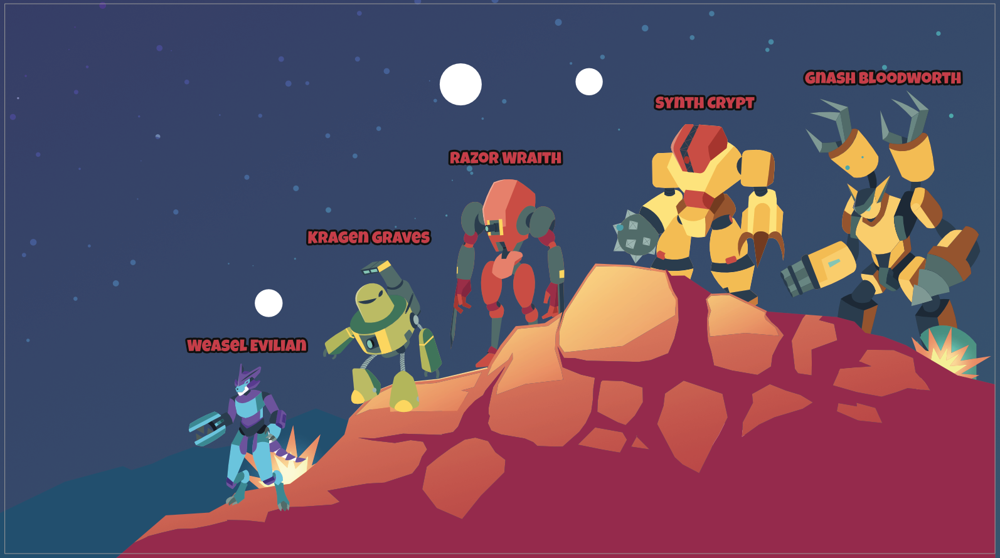

# CollarQuest FOEs

## CollarQuest Fierce Opponent Emulator (FOE)s

Self-bred evil SPARC-Es called Fierce Opponent Emulator (FOE) are terrorizing Ariomont. Players will be able to take on FOEs in real-time battles, either alone or in groups. FOEs will drop an assortment of resources, items, and blueprints used to upgrade Land and individual SPARC-Es.

## **Fierce Opponent Emulator (FOE) Lineup**

<mark style="color:red;">**Weasel Evilian**</mark>**:**  While the weakest of all the FOEs you will face, Weasel is fast, nimble and quick to gaslight others.  Weasel can skitter around, but is not very powerful.  Weasel feels strong when there are more powerful FOEs to buddy up with.  Weasel complains a lot … all talk little teeny action.

_**Power Level:** 1_\
_**Strengths:** nimble, quick, sneaky_\
_**Weaknesses:** not trustworthy, big talk/little action, sniveling, victim complex_

<mark style="color:red;">**Kragen Graves**</mark>**:** Kragen is equipped with two LIGHT bases weapons  -  a LASER blast from up top and a chest phaser. his weakness is his poor sight as he must turn his head to find targets.&#x20;

_**Power Level:** 2_\
_**Strengths:** two effective weapons - LASER blaster from up top and chest level phaser_\
_**Weaknesses:** poor eye sight, slow head rotation to find targets_

<mark style="color:red;">**Razor Wraith**</mark>**:** Razor's dangerous electric swords that extends the arms reach.  Razor moves fluidly… Razor will slice and dice you while gliding like a dancer.  you will die quickly if you are slow to out maneuver Razor.

_**Power Level:** 3_\
_**Strengths:** Razor_ _moves like poetry in motion, slices with deadly electric swords_\
_**Weaknesses:**  lite armor, weak knees._

<mark style="color:red;">**Synth Crypt**</mark>**:**  Synth is a beast to take on.  Watch out for Synth’s mallet, as it can shoot out far beyond your stance.

_**Power level:** 4_\
_**Strengths:** Heavy armor, requires multiple hits to the same area to damage Synth._\
_**Weaknesses:**  slow_

<mark style="color:red;">**Gnash Bloodworth**</mark>**:**  The most formidable FOE in CollarQuest.  You will need to use all of your skills - strength, speed, strategy, power, luck to defeat the behemoth that is Gnash.  &#x20;

_**Power Level:** 5_\
_**Stengths:**  multiple weapons packages_\
_**Weaknesses:** None known_
