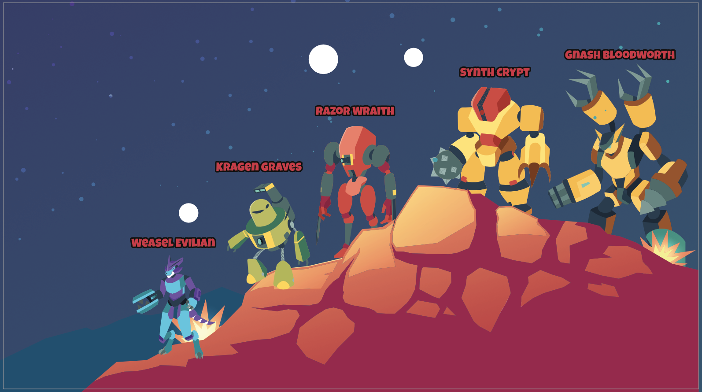

# Fierce Opponent Emulator (FOE)

.png>)

Self-bred evil SPARC-Es called Fierce Opponent Emulator (FOE) are terrorizing Ariomont. Players will be able to take on FOEs in real-time battles, either alone or in groups. FOEs will drop an assortment of resources, items, and blueprints used to upgrade Land and individual SPARC-Es.

## **Fierce Opponent Emulator (FOE) Lineup**

**Weasel Evilian:**  While the weakest of all the FOEs you will face, Weasel is fast, nimble and quick to gaslight others.  Weasel can skitter around, but is not very powerful.  Weasel feels strong when there are more powerful FOEs to buddy up with.  Weasel complains a lot … all talk little teeny action.

_**Power Level:** 1_\
_**Strengths:** nimble, quick, sneaky_\
_**Weaknesses:** not trustworthy, big talk/little action, sniveling, victim complex_

\----

**Kragen Graves:** the second level villain.  Kragen is equipped with two LIGHT bases weapons  -  a LASER blast from up top and a chest phaser. his weakness is his poor sight as he must turn his head to find targets.&#x20;

_**Power Level: 2**_\
_**Strengths:** two effective weapons - LASER blaster from up top and check level phaser_\
_**Weaknesses:** poor eye sight, must turn head to find target._

_----_

**Razor Wraith:** Razor Wraith dangerous with electric swords that are attached to arms.  Razor moves fluidly… this villain will slice and dice you while gliding like a dancer.  you will die quickly you must outthink him jump and shoot.

_**Power Level 3**_\
_**Strengths:** Razor **** moves like poetry in motion, stings like a villain with deadly electric swords_\
_**Weaknesses:**  lite armor, weak knees._

_----_

**Synth Crypt:**  Synth **is** a beast to take on.  Watch out for Synth’s mallet, it can shoot out far beyond your stance and if you get hit by it you will take damage.&#x20;

_**Power level 4**_\
_**Strengths:** Very thick armor, requires multiple hits to the same area to damage Synth._\
_**Weaknesses:**  slow_

\----

**Gnash Bloodworth:**  the most formidable monster in CollarQuest.  You will need to use all of your skills - strength, speed, strategy, power, luck to defeat the behemoth that is Gnash.  &#x20;

_**Power Level 5**_\
_**Stengths:**  multiple weapons packages_\
_**Weaknesses:**_&#x20;
