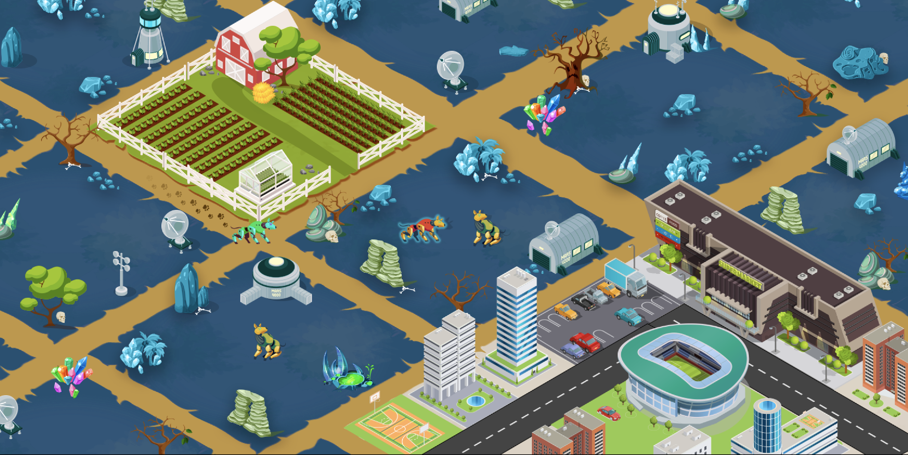

# Land

Ariomont,  the SPARC-E homeland,  is divided into tokenized plots of land which act as homes and bases of operation for their SPARC-E. Plots can be upgraded over time using a variety of resources and crafting ingredients that can be found when playing the game.&#x20;

In addition, land-owners might find TAG tokens on their land plots, or use the SPARC-E  that occupies the land plot to explore resource nodes on the map. When interacting with resources nodes SPARC-E  can find TAG and potentially other resources.&#x20;

**Resource Gathering and Crafting**

* Resources will spawn in nodes across Ariomont and be used to upgrade both land and SPARC-E's.
* Landholders will have first rights to any resources that spawn on their land.

**Real-Time PvE Battles**

Self-breed evil SPARC-E called APEP are terrorizing Ariomont. Players will be able to take on APEP in real-time battles either alone or in groups. APEP will drop an assortment of resources, items, and blueprints used to upgrade land and individual SPARC-E.

Additional details about land will be released in time.

**The World**

Ariomont consists of 90,601 plots of Land. These Land plots are represented as Non-Fungible Tokens and can be freely traded by players.

| Land Type                          | Player-owned | Total supply |
| ---------------------------------- | ------------ | ------------ |
| Rhode Ridge                        | 0            | 22042        |
| Birklands                          | 0            | 22025        |
| Tundra                             | 0            | 16537        |
| Argos                              | 0            | 8264         |
| Inception                          | 0            | 220          |
| Village Green (Center)             | 0            | 3501         |
| Map (water, roads, resource nodes) | 0            | 18012        |
| **Total land**                     | **0**        | **90601**    |

Land gameplay is still being actively developed and will be released in phases.

Phase one is the gameplay mentioned above, and phase two will focus on turning Ariomont into a virtual world with a focus on user-generated content. Players will be able to create games using the Ariomont SDK and place these games on land that they own.&#x20;

### **Can I purchase multiple Land-chests at the same time?** 

Yes. Players can purchase up to 100 Chests of the same type at the same time. You will not be able to buy different kinds of chests with one transaction.

### **Can I decide where to place my Land?** 

Once a Chest has been purchased our algorithm will decide where on the map the Land will be placed within the region associated with the chest.

All Land purchased in the same transaction will be placed next to each other within the same region.

Example: If you purchase 50 Birklands Chests in the same transaction, you will get 50 connected plots of Land in the Birklands Region.

### **What is the advantage of having Land plots connected each the other?** 

There are various benefits of having connected Land plots:

* Every structure in CollarQuest has space requirements. Some structures will require multiple connected Land plots to build.
* Your SPARC-Es will travel faster on Land that you own.
* Connected plots can be managed and viewed all at once.
* Certain items will give spiffs to SPARC-Es on connected lands as well.

### **What are the dimensions of each plot of Land?** 

Every plot of land consists of 64 blocks(8x8).

Every item and structure in Ariomont has a space requirement. Some require one block of Land, while others require more space and resources to build.

### **What is** Inception **Land?** 

Located in the center of the map, Inception land is extremely rare and is capped to 220 plots. There will be rare bosses that spawn on Inception Land, and the owners of Inception Land will get a cut of all the resources collected on their Land.

### **When is Land tradable?** 

Land in Quadrant 1 will be tradable on a date certain to be announced after CollarQuest Land gameplay launches.

### **How many SPARC-Es can fit on one Land plot** 

Initially, 3 SPARC-Es can be assigned to each plot of Land. In the future, Land can be upgraded to hold more SPARC-Es by building specific structures.

### **What kind of structures can be built, and how large can these structures get?** 

Players will find blueprints for structures all across Ariomont when defeating APEP.

Every structure will have a base set of demands that need to be fulfilled to be functional.\
**Time**: Bigger and more advanced structures will require a lot of time to build.

**Block size**: Certain buildings can require up to 6400 blocks of available space. Cooperate with your guildmates and build amazing wonders which will impact the lives of everyone in Ariomont.

**Resources:** Smelt your leftover common/rare/epic items into resources which are required to erect specific structures.

Players will have to apply to the Ariomont High Council for specific blueprints to build shops for monetization. A business plan would prove useful for the application process.

