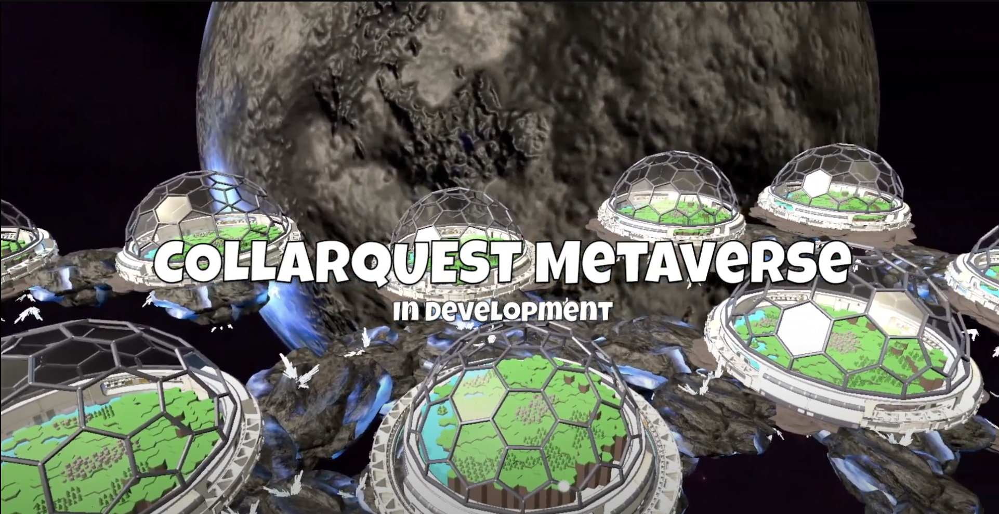

# SATCHEL

The Sparc-e Automated Transportation & Conveyance Humanoid ELement (SATCHEL) will be your robot's remote presence in CollarQuest Ariomont (Land) gameplay.  If you have a wallet with a SPARC-E, you will have a SATCHEL; the DAO may vote to charge for SATCHEL mods.

SATCHEL pros/cons of this humanoid robot could be that a SATCHEL travels fastest with no SPARC-Es deployed and slowest with all 3 SPARC-Es deployed; SPARC-Es can find hidden items when deployed; SPARC-Es do not need to be deployed all or none, thus providing 4 levels of options and cost/benefit of using different gameplay strategy for travel.  We will have other modes of travel to allow SATCHELs to get around the large land play for quests.

Join the conversation https://discord.gg/collarcrew  &#x20;

<figure><figcaption>
CollarQuest Ariomont (Land)
</figcaption></figure>
