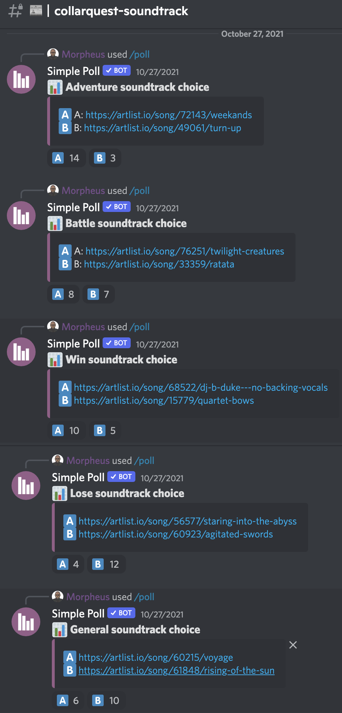

# Soundtrack

<figure><figcaption>
CollarQuest a Metaverse Play2Earn Ecosystem
</figcaption></figure>

## CollarQuest Soundtrack

On October 27, 2021, the #CollarCrew community conducted online polling of the community in selecting the music for CollarQuest.  Below are the results of the polling.

<figure><figcaption>
October 27, 2021 Soundtract Poll Results
</figcaption></figure>

**Links to the winning soundtracks:**\
****\
**Adventure soundtrack choice:** [**https://artlist.io/song/72143/weekands**](https://artlist.io/song/72143/weekands)****\
****\
**Battle soundtrack choice:** [**https://artlist.io/song/76251/twilight-creatures**](https://artlist.io/song/76251/twilight-creatures)****\
****\
**Win soundtrack choice:** [**https://artlist.io/song/68522/dj-b-duke---no-backing-vocals**](https://artlist.io/song/68522/dj-b-duke---no-backing-vocals)****\
****\
**Lose soundtrack choice:** [**https://artlist.io/song/60923/agitated-swords**](https://artlist.io/song/60923/agitated-swords)****\
****\
**General soundtrack choice:** [**https://artlist.io/song/61848/rising-of-the-sun**](https://artlist.io/song/61848/rising-of-the-sun)****
