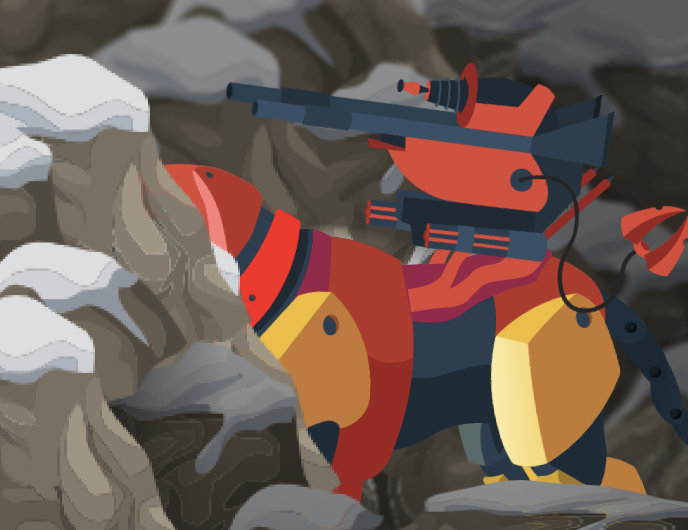

# SPARC-E

## **What are SPARC-Es?**

CollarQuests core gameplay will focus on the adventures of robot dog-types called "Sentient Programmable Assault & Reconnaissance Canine - Entity", or SPARC-E for short. SPARC-Es will be created as NFTs with random characteristics, abilities, and various skills, which may battle against computer-controlled opponents or other real-life players.

## **SPARC-E Stats**

_Each SPARC-E has 4 stats, Health, Fortitude, Skill, and Speed._

**Health (HP)**- The amount of damage your SPARC-E can take before being broken down.

**Fortitude**- Fortitude increases critical strike chance. It also makes entering last stand more likely and adds more last stand “code”.

**Skill**- Skill adds damage when an SPARC-E plays multiple cards at same time (combo). The extra damage is calculated (card attack \* skill )/ 500.

**Speed**- Speed determines turn order. Faster SPARC-Es attack first. If two SPARC-Es have the same speed, this is how attack order is determined: High speed > Low HP > High Skill > High Fortitude > Low Fighter ID

An SPARC-Es stats are dependent on two variables: its class and its body parts.
