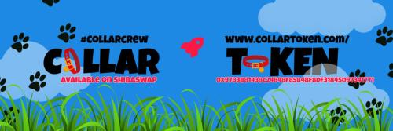

# Community Committees

The purpose of the Dog Collar \(COLLAR\) DAO is to cement that the COLLAR Community is under the direction of the COLLAR DAO, and by extension, the COLLAR HODL is in control of the COLLAR ERC-20 Token.  See [How Voting Works](how-voting-works.md) to learn more about how the DAO operates.

The following areas of focus benefit the COLLAR Community.

* Charity
* Governance
* Marketing
* Partnerships
* Social Media
* Utility

