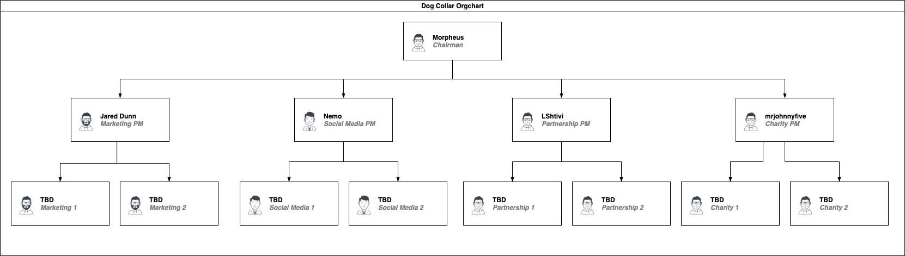

# Committee Org Chart

## CollarQuest Organizational Chart

The CollarQuest Organizational Chart is our way of showing that the current Multi-signature individuals; CollarQuest DAO as a community have voted to assist in the growth of the CollarCrew future.

This document is to help new CollarCrew members to understand the positions acquired but to always keep in mind we are all CollarCrew. All individuals elected joined the CollarCrew and helped CollarQuest evolve into what we are today. You too may grow into what you desire as we are all part of this community together.

On September 3, 2021, the following people were installed as our founding multi-signature wallet signers are; Position #1 Morpheus (Ceremonial CEO), position #2 Jared Dunn, position #3 Mr. Johnny Five, position #4 Nemo, position #5 LShtivi. The multi-signature wallet signers are NOT granted any additional authority over the CollarQuest ecosystem project.

These positions are for two (2) year terms. With the best practice of not having 100% oversight turnover, we have created a staggered process to provide the best protection to our community. Position #1 and #3 will be up for election by December 31, 2022, position #2, #4 and #5 will be up for election by December 31, 2023.

In the CollarCrew community, each Committee Chair will work with other members to build the working committee. The committee Chair's role is to help facilitate the committee's process and provide assistance where needed.

Committee Chairs may bring forward a committee recommendation for review and to confirm the proposal follows our founding vision before recommendation moving forward for public debate
