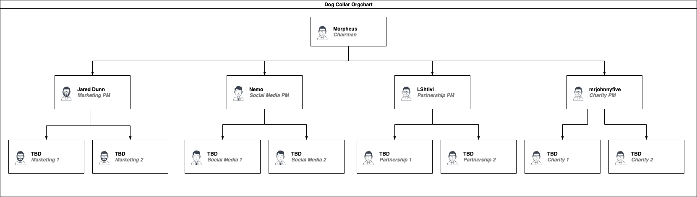

# Organizational Chart

September 20, 2021 - Purposed new language for consideration.

## `Dog Collar (COLLAR) Organizational Chart`

`The COLLAR Organizational Chart is our way of showing the current elected people that the COLLAR community has voted to assist in the growth of the #collarcrew community.`

`This document is to help new #collarcrew members to understand better than before they joined the #collarcrew that the community elected these people to help COLLAR.`

`On September 3, 2021, the following people were installed as our founding multi-signature wallet signers are; Position #1 Morpheus, position #2 Jared Dunn, position #3 Mr. Johnny Five, position #4 Nemo, position #5 LShtivi. The multi-signature wallet signers are NOT granted additional authority over the Dog Collar (COLLAR) project.`

`Position terms. These positions are for two (2) year terms. With the best practice of not having 100% oversight turnover, we have created a staggered process to provide the best protection to our community. Position #1 and #3 will be up for election by December 31, 2022, position #2, #4 and #5 will be up for election by December 31, 2023.`

`If adopted by the #collarcrew community, each committee chair will work with other members to build the working committee. The committee chair's role is to help facilitate the committee's process and provide assistance where needed.`

`Committee chairs may bring forward a committee recommendation to the COLLAR leadership for review and to confirm the proposal follows our founding vision before that recommendation moving forward for public debate`

