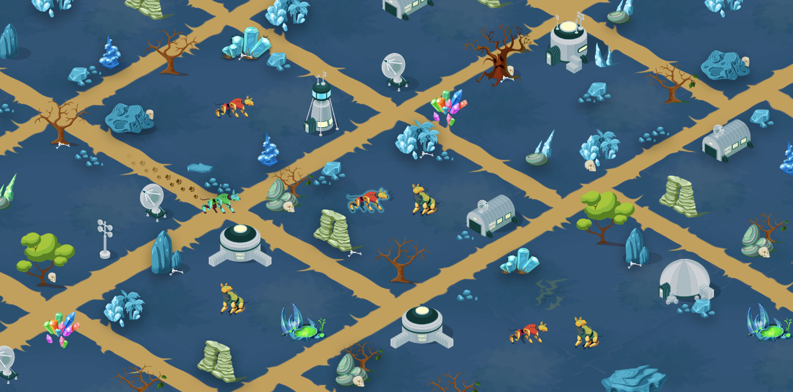

# CollarQuest LAND

### **What is CollarQuest Land Sales, and Step Phases?** 

The Land sale will consist of four different phases. Phase 1 Step Release consists of 21,744 plots that can be purchased.  Phase 2–4 will launch after land gameplay is released.  Figure K visualizes the minting schedule for each Step Release Phases.

### **Can I purchase multiple Land-chests at the same time?** 

Yes. Players can purchase up to 100 Chests of the same type at the same time. You will not be able to buy different types of chests with one transaction.

## **Can I decide where to place my Land?** 

Once a Chest has been purchased our algorithm will decide where on the map the Land will be placed within the region associated with the chest.

All Land purchased in the same transaction will be placed next to each other within the same region.

Example: If you purchase 50 Birklands Chests in the same transaction you will get 50 connected plots of Land in the Birklands Region.

### **What is the advantage of having Land plots connected each other?** 

There are various benefits of having connected Land plots:

* Every structure in CollarQuest has space requirements. Some structures will require multiple connected Land plots to build.
* Your SPARC-Es will travel faster on land that you own.
* Connected plots can be managed and viewed all at once.
* Certain items will give spiffs to SPARC-Es on connected lands as well.

### **What are the dimensions of each plot of Land?** 

Every plot of land consists of 64 blocks(8x8).

Every item and structure in Ariomont has a space requirement. Some require 1 block of land while others require more space and resources to build.

### **What is **Inception** Land?** 

Located in the center of the map Inception land is extremely rare and is capped to 220 plots. There will be rare bosses that spawn on Inception Land and the owners of Inception Land will get a cut of all the resources that are collected on their Land.

### **When is Land tradable?** 

Land in Quadrant 1 will be tradable on a date certain to be announced after CollarQuest Land gameplay launches.

### **How many SPARC-Es can fit on one Land plot** 

Initially, 3 SPARC-Es can be assigned to each plot of land. In the future, Land can be upgraded to hold more SPARC-Es by building certain structures.

### **What kind of structures can be built and how large can these structures get?** 

Players will find blueprints for structures all across Ariomont when defeating Improbus.

Every structure will have a base set of demands which need to be fulfilled for it to be functional.\
**Time**: Bigger and more advanced structures will require a lot of time to build.

**Block size**: Certain buildings can require up to 6400 blocks of available space. Cooperate with your guild mates and build amazing wonders which will impact the lives of everyone in Ariomont.

**Resources:** Smelt your leftover common/rare/epic items into resources which are required to erect specific structures.

Players will have to apply to the Ariomont High Council for specific blueprints which allow them to build shops for monetization. A business plan would prove useful in these situations.
