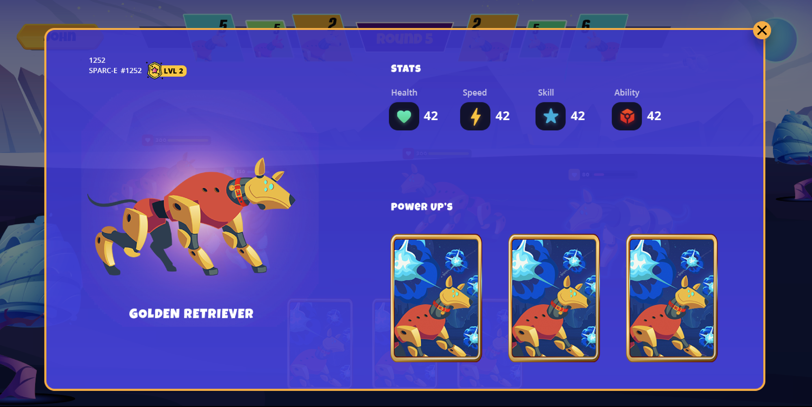
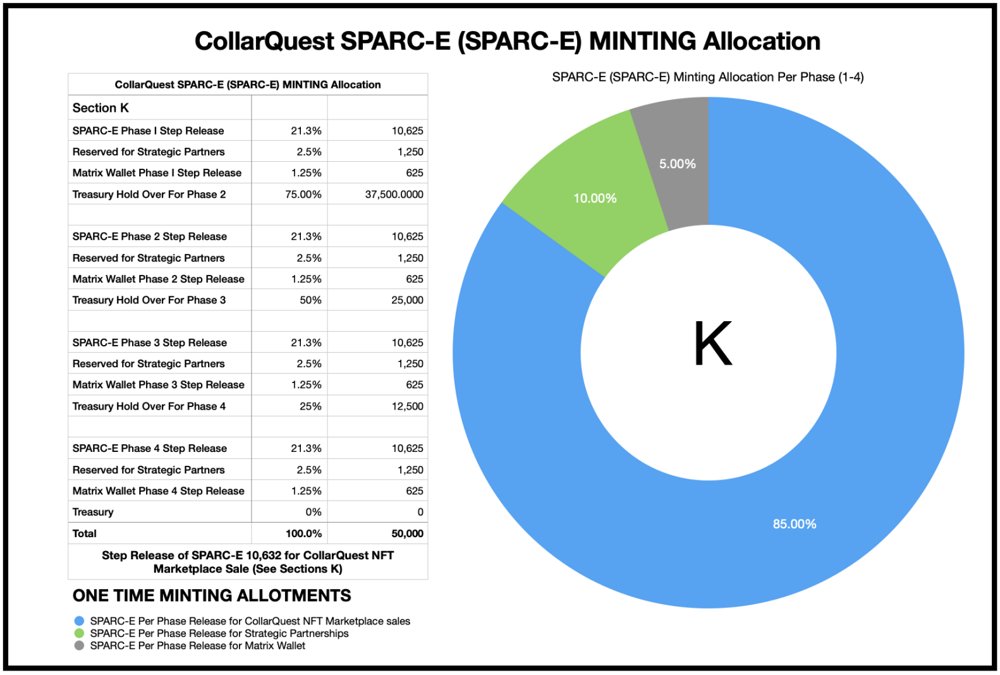

# CollarQuest SPARC-E

Sentient Programmable Assault & Reconnaissance Canine - Entity (SPARC-E). SPARC-Es will be created as NFTs with random characteristics, abilities, and various skills, which may battle against computer-controlled opponents or other real-life players.

The in-game SPARC-Es are NFTs, a unique digital asset exclusively owned by you! Any SPARC-E created or purchased through the game’s breeding mechanics will be an original digital asset that can be played, sold, or transferred in or out of the game!

To start playing CollarQuest, you will need to create a CollarQuest account and buy a starter team of three (3) SPARC-Es. You can buy as many SPARC-E as you wish to purchase, but you can only play a team of 3 SPARC-E at anyone time. Those lucky to have more than 3 SPARC-e can choose to make any additional teams available for CollarQuest Academy.

You can buy SPARC-E from the official CollarQuest Marketplace. Here, you will use the search filters to find stats and traits of your desired SPARC-Es.

Players can also trade SPARC-E peer-to-peer, meaning you can purchase directly from other players, or your friends can give you SPARC-E for free (lucky you!). More information about our CollarQuest Marketplace will be released as we get closer to releasing CollarQuest Marketplace.

### Should you buy a more expensive SPARC-Es?

The cheapest SPARC-E, sometimes called “Common” SPARC-E, are cheap for a reason. They usually have a terrible combination of stats and body parts that do not have good synergy.

In most cases, more expensive SPARC-E than the base price tends to have better body parts, stats, and abilities.

Investing in a more expensive team will get you ahead of others.

Having a more powerful team from the beginning means you will get to farm GeM faster in Adventure and Arena mode.

So, if you can save up a bit before purchasing your first team, we highly recommend avoiding common SPARC-Es for your starter team.

Regardless, as long as you can find SPARC-Es that give you the best value, even budget starter teams should be enough to get you started.

Figure J shows the four (4) Step releases that we also call phases 1-4. Phase 1 will release 12,500 SPARC-Es priced in three (3) different levels (50% Common, 35% Uncommon, and 15% Rare). The odds of receiving special abilities or power-ups increase from purchasing Uncommon over Common or Rare over Common and Uncommon level SPARC-Es.

The SPARC-E sales will consist of four different phases. Phase 1 Step Release consists of 12,500 SPARC-Es that can be purchased. Phase 2–4 step release will happen prior to the game floor opening. Figure J visualizes the minting schedule for each Step Release Phase.&#x20;

SPARC-Es will be created as NFTs with random characteristics, abilities, and various skills, which may battle against computer-controlled opponents or other real-life players.&#x20;

The in-game SPARC-Es are NFTs, a unique digital asset exclusively owned by you! Any SPARC-E created or purchased through the game’s replicating mechanics will be an original digital asset that can be played, sold, or transferred in or out of the game!&#x20;

To start playing CollarQuest, you will need to create a CollarQuest account and buy a starter team of three (3) SPARC-Es. You can buy as many SPARC-E as you wish to purchase, but you can only play a team of 3 SPARC-E at anyone time. Those lucky enough to have more than 3 SPARC-E can choose to make any additional teams available for CollarQuest Academy.&#x20;

Players can also trade SPARC-E peer-to-peer, meaning you can purchase directly from other players, or your friends can give you SPARC-E for free (lucky you!). More information about our CollarQuest Marketplace will be released as we get closer to releasing CollarQuest Marketplace.
