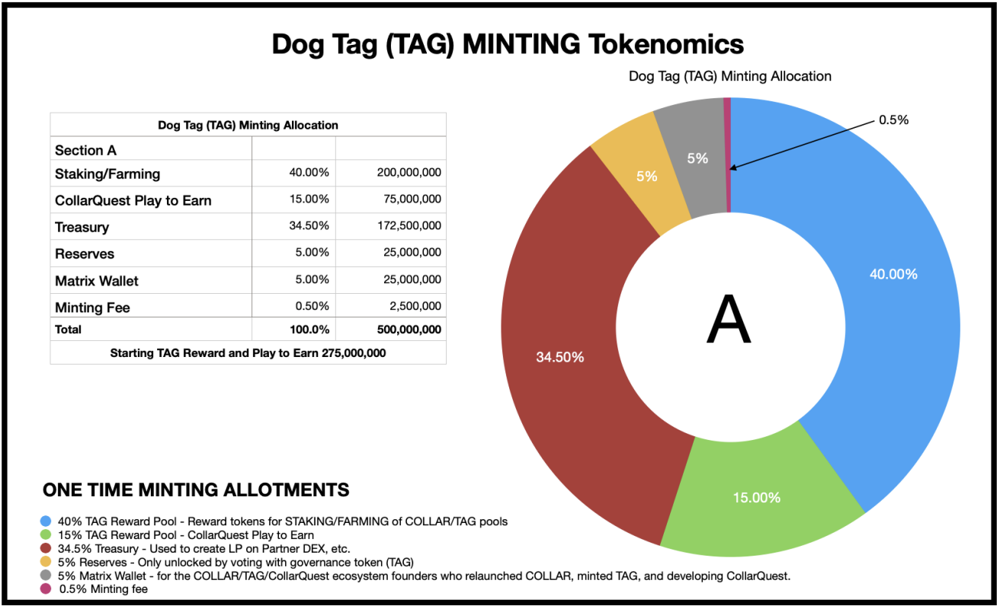

# Dog Tag (TAG)

## **Dog Tag (TAG) Reward and Governance Token to COLLAR**

TAG will be unlocked in a pre-determined schedule which lasts for 84 months from the public STAKING/FARMING released on the CollarSwap (ETH) and QuickSwap (POLY) platforms.  200,000,000 Dog Tag (TAG) Tokens will be released over an 60-month term for STAKING/FARMING.  75,000,000 Dog Tag (TAG) Tokens will be released on CollarQuest over an 48-month term from gameplay.

Dog Collar Token (COLLAR) will host TAG rewards on CollarSwap (ETH) and QuickSwap (POLY) platforms.

Figure A2 visualizes the ONGOING distributions of the governance token called TAG.  TAG is still going through a tokenomics design review.  The TAG fundamentals design goals are to provide a market competitive incentive for STAKING and FARMING of COLLAR and TAG to receive fees and the reward token Dog Tag (TAG).  As of the writing of the COLLAR CP 1.1, you will see we intentionally blacked out the percentage rewards from the tokenomics design review.  Dog Tag (TAG) has been minted and can be seen [here](https://etherscan.io/token/0x7797c85b46f548eacc07c229f6cd207d6370442f).

See the [**etherscan.io**](https://etherscan.io/token/0x7797c85b46f548eacc07c229f6cd207d6370442f) information on [**TAG**](https://etherscan.io/token/0x7797c85b46f548eacc07c229f6cd207d6370442f), additional information will be released in the future.

Minting provider CERTIK code audit for Dog Tag (TAG)

Dog Tag (TAG) is an ERC-20 governance token for the CollarQuest metaverse. TAG holders will be able to claim rewards if they stake their tokens, play the game, and participate in key governance votes. Players will also be able to earn $TAG when they play various games within the CollarQuest metaverse and through user-generated content initiatives.

Our goal with TAG is to align the incentives between the players of the game and the developers in novel and exciting ways. The mechanisms described above have two main goals:&#x20;

* To reward players for interacting with CollarQuest while simultaneously incentivizing them to hold on to their tokens so they can claim additional rewards.
* To decentralize the ownership and governance of CollarQuest DAO, TAG, CollarQuest referred to as the CollarQuest Ecosystem.

We want the CollarQuest Ecosystem to become the first game truly owned and operated by the community that plays it.  This opens up limitless possibilities but must be approached carefully. In the past, projects have been abandoned and become stagnant using the term “decentralization” as a ruse.

Once our exchange partner Goji Crypto onboards COLLAR and TAG, then the Community Treasury will begin to receive revenues generated from a portion of staking rewards. This treasury will be governed by CollarQuest DAO.


