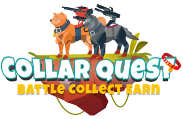
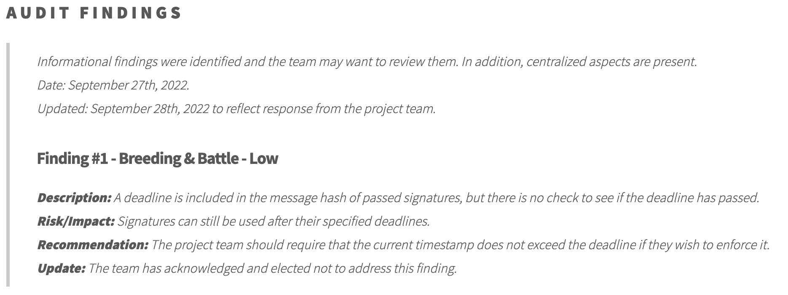
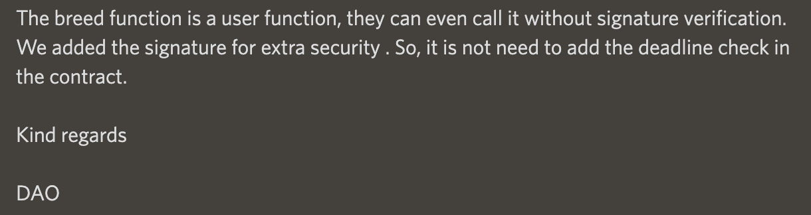
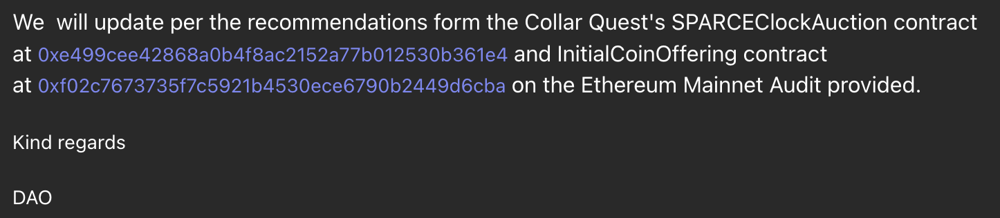

# Smart Contracts and Audits

<figure><figcaption>
CollarQuest a Metaverse Play2Earn Ecosystem
</figcaption></figure>

## TAG DAO LLC Smart Contracts (ERC-20, Marketplace, Swap and Game)

## **CollarQuest.com**

_**SPARC-E**_

_**Code:**_ [https://etherscan.io/address/0x674900b8fd8ee1b487d162d04c59300222d90466#code](https://etherscan.io/address/0x674900b8fd8ee1b487d162d04c59300222d90466#code) _****_&#x20;

_**Audit Sept 23, 2022:**_ [_**https://solidity.finance/audits/CollarQuestSPARCE/**_](https://solidity.finance/audits/CollarQuestSPARCE/)_****_

_****_

_**SPARCEManagerCustomizable**_

_**Code:**_ [https://etherscan.io/address/0x3041680f5494e340bdba3dc982cf1d2f621dc068#code](https://etherscan.io/address/0x3041680f5494e340bdba3dc982cf1d2f621dc068#code)

_**Audit Sept 23, 2022:**_ [_**https://solidity.finance/audits/CollarQuestSPARCE/**_](https://solidity.finance/audits/CollarQuestSPARCE/)_****_

_****_

_**Battle**_

_**Code:**_ [https://etherscan.io/address/0x9c04d75924fd2e06c5d8fa986e4de1bd11342735#code](https://etherscan.io/address/0x9c04d75924fd2e06c5d8fa986e4de1bd11342735#code)

_**Audit Sept 27, 2022:**_ [_**https://solidity.finance/audits/CollarQuestBattleAndBreeding/**_](https://solidity.finance/audits/CollarQuestBattleAndBreeding/) __&#x20;

__

_**Breeding**_

_**Code:**_ [https://etherscan.io/address/0xc9b47dcb7f55175e03483dc626158a37e7a73516#code](https://etherscan.io/address/0xc9b47dcb7f55175e03483dc626158a37e7a73516#code)

_**Audit Sept 27, 2022:**_ [_**https://solidity.finance/audits/CollarQuestBattleAndBreeding/**_](https://solidity.finance/audits/CollarQuestBattleAndBreeding/)_****_

<figure><figcaption>
Solidity Finance Breeding Finding #1 (Figure A)
</figcaption></figure>

Figure A identifies one (1) LOW risk/impact.  Our response is shown in Figure B below.

<figure><figcaption>
TAG DAO LLC Finding #1 (Figure B) Response
</figcaption></figure>

_**SPARCEClockAuction**_

_**Code:**_ [https://etherscan.io/address/0xe499cee42868a0b4f8ac2152a77b012530b361e4#code](https://etherscan.io/address/0xe499cee42868a0b4f8ac2152a77b012530b361e4#code)

Audit findings impact on launch:  At launch of CollarQuest.com, the NFT Marketplace does not utilize any auction function referenced.  Our response is shown in Figure C


Solidity Finance Breeding Finding 1, 2, and 3 (Figure C)


<figure><figcaption>
TAG DAO LLC Finding 1, 2, and 3 (Figure D) Response
</figcaption></figure>

_**InitialCoinOffering**_

_**Code:**_ [https://etherscan.io/address/0xf02c7673735f7c5921b4530ece6790b2449d6cba#code](https://etherscan.io/address/0xf02c7673735f7c5921b4530ece6790b2449d6cba#code)


Solidity Finance Breeding Remaining Findings (Figure E)


<figure><figcaption>
TAG DAO LLC Remaining Finding (Figure F) Response
</figcaption></figure>

## **CollarSwap.io**

_**CollarSwapFactory**_

_**Code:**_ [https://etherscan.io/address/0xe15b4d98af270161219d2349f160dfdee7abce40#code](https://etherscan.io/address/0xe15b4d98af270161219d2349f160dfdee7abce40#code)

_**Audit October 26,  2022:**_ [_**https://solidity.finance/audits/CollarSwap/**_](https://solidity.finance/audits/CollarSwap/)_****_

_**WETH**_

_**Code:**_ [https://etherscan.io/address/0xc02aaa39b223fe8d0a0e5c4f27ead9083c756cc2#code](https://etherscan.io/address/0xc02aaa39b223fe8d0a0e5c4f27ead9083c756cc2#code)

_**Audit October 26,  2022:**_ [_**https://solidity.finance/audits/CollarSwap/**_](https://solidity.finance/audits/CollarSwap/)_****_

__

_**CollarSwapRouter**_

_**Code:**_ [https://etherscan.io/address/0xc67f50f4a93147268d45f5cd7e444ec94eb046c7#code](https://etherscan.io/address/0xc67f50f4a93147268d45f5cd7e444ec94eb046c7#code)

_**Audit October 26,  2022:**_ [_**https://solidity.finance/audits/CollarSwap/**_](https://solidity.finance/audits/CollarSwap/)_****_

__

_**CollarStake**_

_**Code:**_ [https://etherscan.io/address/0x445332f0719f9e66721536323a5d6a2677fe8080#code](https://etherscan.io/address/0x445332f0719f9e66721536323a5d6a2677fe8080#code)

_**Audit October 26,  2022:**_ [_**https://solidity.finance/audits/CollarSwap/**_](https://solidity.finance/audits/CollarSwap/)_****_

_**CollarFlexStake**_\
_****_\
_**Code:** _ [_https://goerli.etherscan.io/address/0x23b80e02e9b058b950feebb5ba8c4e38c8fdedd1#code_](https://goerli.etherscan.io/address/0x23b80e02e9b058b950feebb5ba8c4e38c8fdedd1#code)__

_**Audit January 18, 2023:** _ [_https://solidity.finance/audits/CollarStake/_](https://solidity.finance/audits/CollarStake/)__

## _ERC-20_

_**Dog Collar (COLLAR)**_

_**Code:**_ [https://etherscan.io/token/0x9783b81438c24848f85848f8df31845097341771#code](https://etherscan.io/token/0x9783b81438c24848f85848f8df31845097341771#code)

_**Audit:** None, see the Burn, Lock, and Inspect the CODE under "_Token Transparency" on [https://www.tagdao.llc](https://www.tagdao.llc)&#x20;

_**Dog Tag (TAG)**_

_**Code:**_ [https://etherscan.io/token/0x7797C85b46F548eAcC07C229f6Cd207d6370442f#code](https://etherscan.io/token/0x7797C85b46F548eAcC07C229f6Cd207d6370442f#code)

_**Audit:** _ [_See CollarQuest Tokenomics > Dog Tag (TAG)_](dog-tag/)__

_****_

_**Genesis Mechanism (GeM)**_

_**Code:**_ [https://etherscan.io/token/0xeBC27d9Bd8AC268934784Dcdf1eaA10dFaF97A9F#code](https://etherscan.io/token/0xeBC27d9Bd8AC268934784Dcdf1eaA10dFaF97A9F#code)

_**Audit:** _ [_See CollarQuest Tokenomics > Genesis Mechanism (GeM)_](genesis-mechanism-gem/)__
